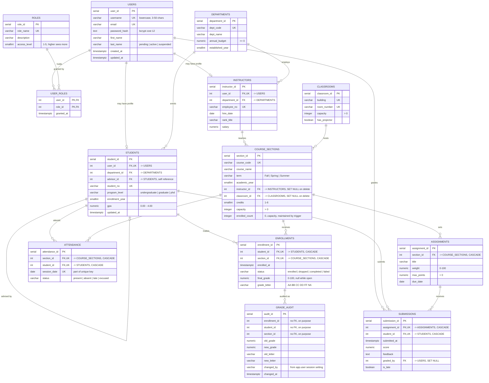

# Entity–Relationship Diagram

Rendered by GitHub from the Mermaid source below. To edit the diagram,
change the fenced block — not an exported image.

## Relationship summary

| From | To | Cardinality | Meaning |
|---|---|---|---|
| `users` | `user_roles` | 1 : M | a user holds zero or more roles |
| `roles` | `user_roles` | 1 : M | a role is held by zero or more users |
| `users` | `students` | 1 : 0..1 | a login may have one student profile |
| `users` | `instructors` | 1 : 0..1 | a login may have one instructor profile |
| `departments` | `students` | 1 : M | a department has many students |
| `departments` | `instructors` | 1 : M | a department has many instructors |
| `students` | `students` | 1 : 0..1 | a student may be advised by another student |
| `students` | `enrollments` | 1 : M | a student enrols in many sections |
| `course_sections` | `enrollments` | 1 : M | a section has many enrolments |
| `instructors` | `course_sections` | 1 : M | an instructor may teach many sections |
| `classrooms` | `course_sections` | 1 : M | a room hosts many sections |
| `course_sections` | `assignments` | 1 : M | a section has many assignments |
| `assignments` | `submissions` | 1 : M | an assignment receives many submissions |
| `students` | `submissions` | 1 : M | a student submits many assignments |
| `users` | `submissions` | 1 : 0..1 | a user may be recorded as the grader |
| `course_sections` | `attendance` | 1 : M | attendance is recorded per section |
| `students` | `attendance` | 1 : M | attendance is recorded per student |
| `enrollments` | `grade_audit` | 1 : M | every grade change is audited |

`grade_audit` deliberately has **no foreign keys**. An audit trail that
cascaded away when the row it describes was deleted would not be an
audit trail.

## Diagram

## Referential integrity actions

Choosing `ON DELETE` behaviour per relationship is a design decision,
not a default:

| Relationship | Action | Reasoning |
|---|---|---|
| `students.user_id` | `CASCADE` | A student profile has no meaning without its login |
| `enrollments.student_id` | `CASCADE` | Enrolment is meaningless without the student |
| `enrollments.section_id` | `CASCADE` | Same, in the other direction |
| `submissions.assignment_id` | `CASCADE` | Removing an assignment removes its submissions |
| `attendance.section_id` | `CASCADE` | Same |
| `instructors.user_id` | `CASCADE` | A profile without a login is unreachable |
| `course_sections.instructor_id` | `SET NULL` | Deleting a staff member must not delete real teaching history; the section survives, unassigned |
| `course_sections.classroom_id` | `SET NULL` | Reassigning a room should not delete a course |
| `submissions.graded_by` | `SET NULL` | Losing the grader's account must not delete the mark |
| `users.user_roles` | `CASCADE` | Roles vanish with the account, which is correct |
| `users.user_roles` → `roles` | `RESTRICT` | A role still in use cannot be deleted out from under its holders |

## Constraints not visible in an ER diagram

An ER diagram shows keys and cardinality. These rules live in the DDL
and are worth stating separately:

| Constraint | Rule enforced |
|---|---|
| `ck_enrollments_final` | A closed enrolment (`completed`/`failed`) must carry a grade; an open one (`enrolled`/`dropped`) must not |
| `ck_sections_enrolled` | `enrolled_count` can never exceed `capacity` |
| `ck_students_gpa` | GPA stays within 0.00–4.00 |
| `ck_assignments_weight` | An assessment's weight is within 0–100 |
| `ck_users_username` | Lowercase, 3–50 characters |
| `uq_enrollments_student_section` | One enrolment per student per section; re-enrolling revives the withdrawn row instead of adding a second |
| `uq_submissions_assignment_student` | One submission per student per assignment |
| `uq_attendance_session` | One attendance mark per student per session, which lets the form upsert |